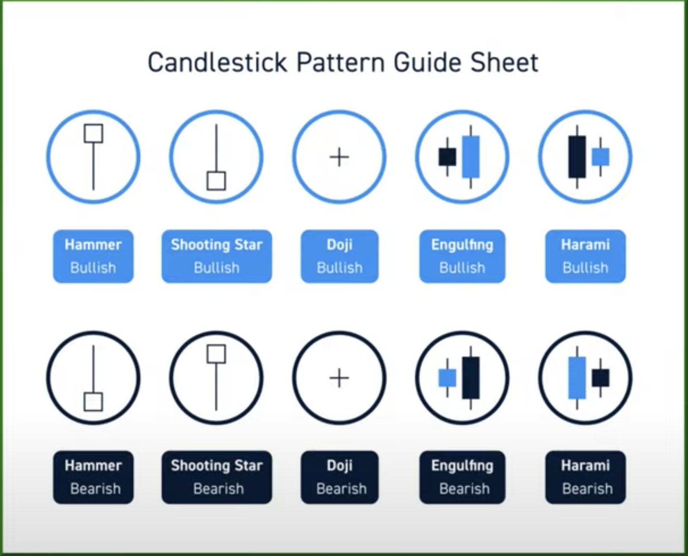
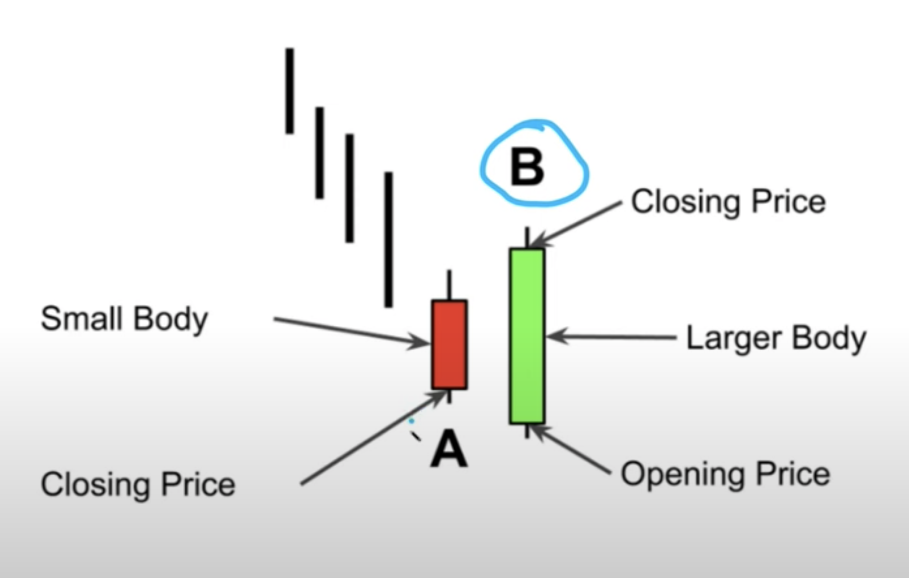

CANDLESTICK PATTERNS
====================

Candlestick Pattern Guide Sheet:

Bullish Hammer:
--------------

- It can either be in green or red. Does not matter. Still Bullish
- Prefer Wick size is 2 or 3 times greater than body size.
- On top, if small wick is there, we can ignore.
- Hammer pattern will work, when in downtrend.
- In downtrend, when hammer appears, then there will be reversal buying pattern.
- Here, selling pressure dominated by buying.
- Best entry point is body close.
- Stop loss will be below wick at support level. 

Bearish Shooting Star:
----------------------

- When this patterns occur, then its reversal sell zone.
- It can either be in green or red. Does not matter. Still Bearish.
- Though price went up, selling pressure brought the price down.
- Shooting star will work when it appears in uptrend. 
- After this pattern, we can expect reversal sell zone.
- It works great, when it appears at resistance level.
- Entry will be body close, stop loss will be above wick or resistance whichever is lower.

Doji CandleStick:
-----------------
- Candle has no body or little body is called as Doji Candle.
- This is Indecision candle. 
- If Doji appears in downtrend, then this indicates downtrend is cooling down. 
- If Doji appears in sideways trend, then it does not tell anything.

Bulling Engulfing Patters:
---------------------------

- In Downtrend, if this pattern appears then we can expect reversal buy zone.

Bearish Engulfing Patters:
---------------------------

Island Reversal:
----------------

- In downtrend, there will be a gap.
- After gap island area will occur. it will be in sideways.
- After sideways, again gap will be filled and uptrend will start.
- Entry will be body high, stop loss will be wick low.
