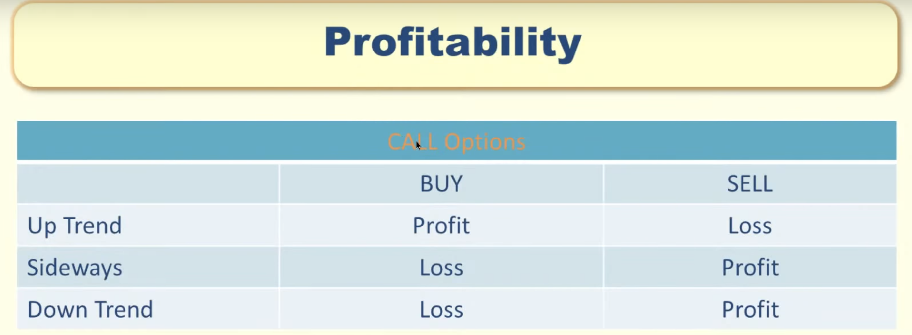
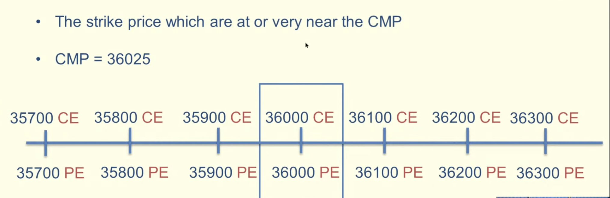
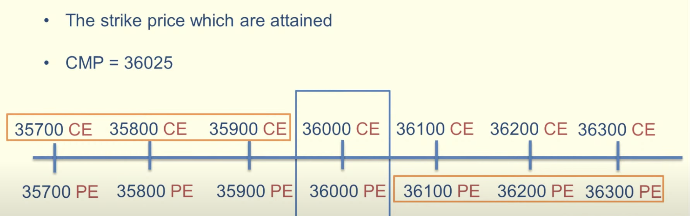
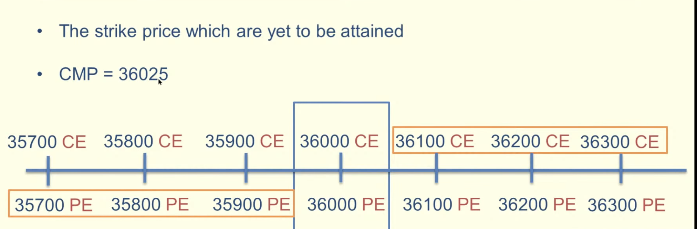
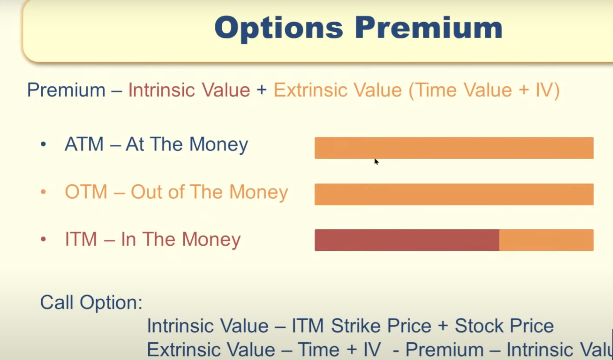
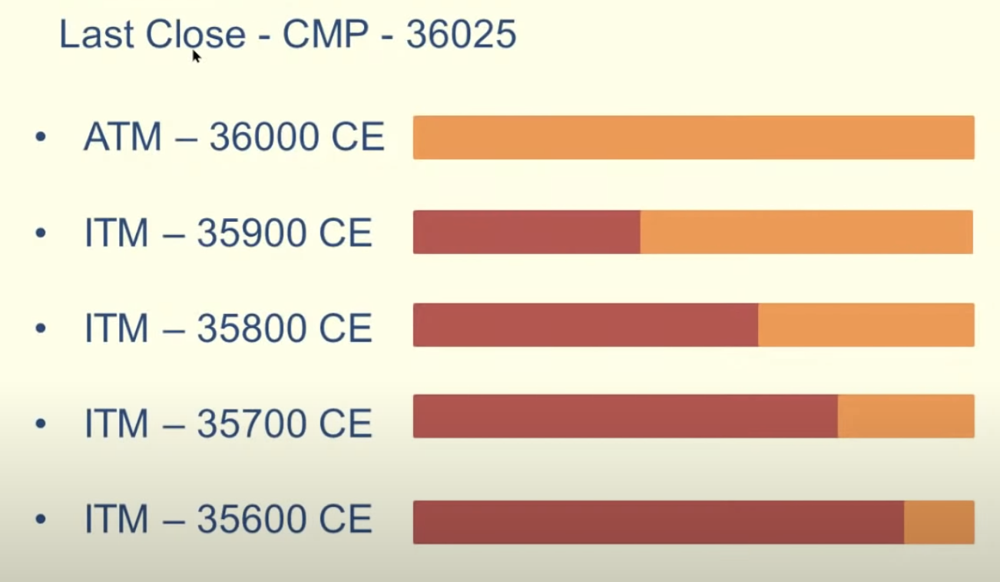

Owning Stocks means we are owning the underlying stocks.
Options means we are predicting whether stock will go or up.
Owning options means we have that contract but we dont own any stocks.
Make profit from market movement.

Always we can buy Options for 100 shares(1 contract). We dont have to buy underlying shares.
Options will have expiry but stocks will not have any expiry.
Options expires on Every Friday in NASDAQ.

CALL OPTIONS:
==============

- Predicting Stock price will go up.

PUT Options:
==============

- Predicting Stock price will go down.

Strike Price:
==============
- Price in which we make Call/Put options.
- Difference between strike price range should equal for the stock. This is called as "Strike Difference"

ATM - At The Money

ITM - In The Money

OTM - Out of The Money

Options Premium:
=================
 - When stock price goes up, Call Option premium will go up & Put Option premium will go down.
 - When stock price goes down, Put Options premium will go up & Call Option premium will go down.
    

Intrinsic Value = value don't get change. It will be only in "In the Money(ITM) Strike Price"
Extrinsic Value = value gets change based on multiple factors(Time Decay, Implied Volatility). 

Extrinsic Value will be 0 on expiry.

Eg:

Calculation:
-------------
Premium = Intrinsic Value + Extrinsic Value

Call Options:
   Intrinsic Value : Current Market Price(CMP) - ITM Strike Price
   Extrinsic Value : Premium - Intrinsic Value
   
 
Eg1:  
   CMP: 36000,
   Strike Price: 35800 CE,
   Premium: 800
   
     Intrinsic Value = Current Market Price(CMP) - ITM Strike Price
   
                   = 36000  -  35800
                   = 200
                   
     Extrinsic Value = Premium - Intrinsic Value
   
                   = 800 - 200
                   = 600              
   
   
Eg2:  
   CMP: 36000,
   Strike Price: 35500 CE,
   Premium: 800
   
     Intrinsic Value = Current Market Price(CMP) - ITM Strike Price
   
                   = 36000  -  35500
                   = 500
                   
     Extrinsic Value = Premium - Intrinsic Value
   
                   = 800 - 500
                   = 300
                   

Eg3:  
   CMP: 36000,
   Strike Price: 37000 CE,
   Premium: 800
   
     Intrinsic Value = Current Market Price(CMP) - ITM Strike Price
   
                   = 0 ( Becuase Strike Price is in OTM)
                 
                   
     Extrinsic Value = Premium - Intrinsic Value
   
                   = 800 - 0
                   = 800

