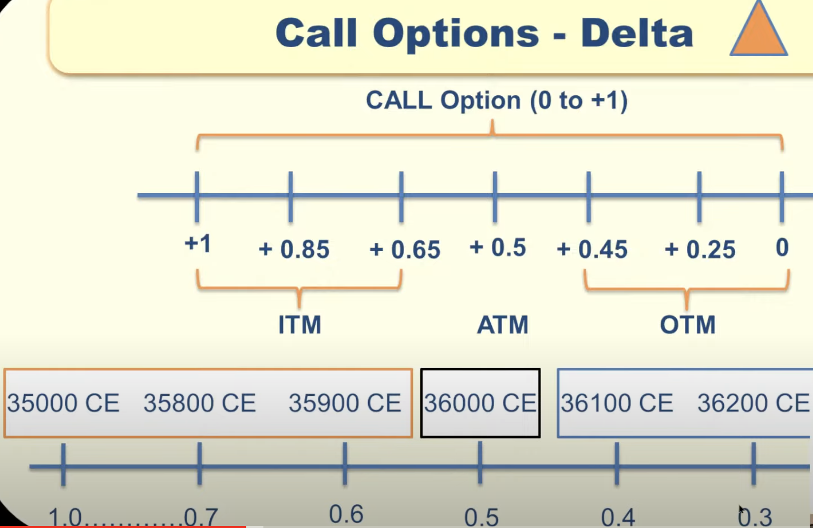
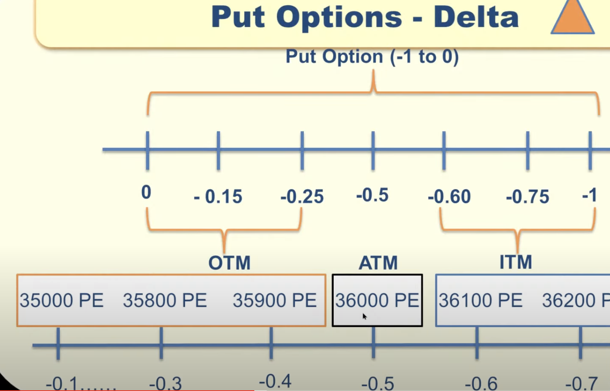
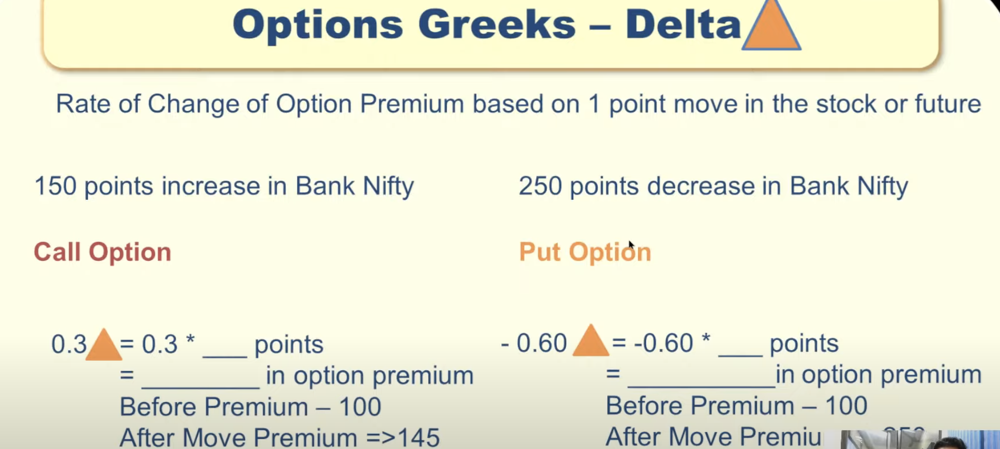
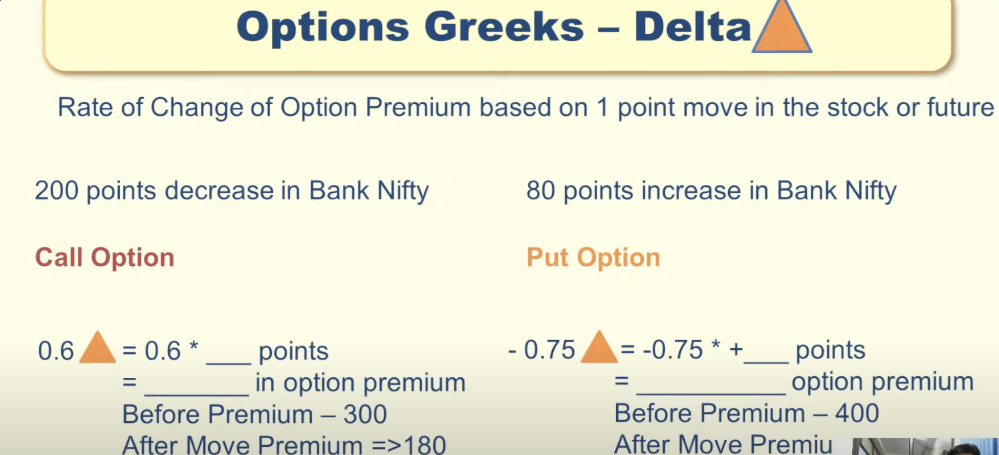

Owning Stocks means we are owning the underlying stocks.
Options means we are predicting whether stock will go or up.
Owning options means we have that contract but we dont own any stocks.
Make profit from market movement.

Always we can buy Options for 100 shares(1 contract). We dont have to buy underlying shares.
Options will have expiry but stocks will not have any expiry.
Options expires on Every Friday in NASDAQ.

CALL OPTIONS:
==============

- Predicting Stock price will go up.

PUT Options:
==============

- Predicting Stock price will go down.

Strike Price:
==============
- Price in which we make Call/Put options.
- Difference between strike price range should equal for the stock. This is called as "Strike Difference"

ATM - At The Money

ITM - In The Money

OTM - Out of The Money

Options Premium:
=================
 - When stock price goes up, Call Option premium will go up & Put Option premium will go down.
 - When stock price goes down, Put Options premium will go up & Call Option premium will go down.
    

Intrinsic Value = value don't get change. It will be only in "In the Money(ITM) Strike Price"

Extrinsic Value = value gets change based on multiple factors(Time Decay, Implied Volatility). 

Extrinsic Value will be 0 on expiry.

Eg:

Calculation:
-------------
Premium = Intrinsic Value + Extrinsic Value

Call Options:

   Intrinsic Value : Current Market Price(CMP) - ITM Strike Price
   
   Extrinsic Value : Premium - Intrinsic Value
   
 
Eg1:  
   CMP: 36000,
   Strike Price: 35800 CE,
   Premium: 800
   
     Intrinsic Value = Current Market Price(CMP) - ITM Strike Price
   
                   = 36000  -  35800
                   = 200
                   
     Extrinsic Value = Premium - Intrinsic Value
   
                   = 800 - 200
                   = 600              
   
   
Eg2:  
   CMP: 36000,
   Strike Price: 35500 CE,
   Premium: 800
   
     Intrinsic Value = Current Market Price(CMP) - ITM Strike Price
   
                   = 36000  -  35500
                   = 500
                   
     Extrinsic Value = Premium - Intrinsic Value
   
                   = 800 - 500
                   = 300
                   

Eg3:  
   CMP: 36000,
   Strike Price: 37000 CE,
   Premium: 800
   
     Intrinsic Value = Current Market Price(CMP) - ITM Strike Price
   
                   = 0 ( Becuase Strike Price is in OTM)
                 
                   
     Extrinsic Value = Premium - Intrinsic Value
   
                   = 800 - 0
                   = 800
                   
                   
Put Options:
   Intrinsic Value : ITM Strike Price - Current Market Price(CMP)
   Extrinsic Value : Premium - Intrinsic Value
 

Eg1:  
   CMP: 36000,
   Strike Price: 36500 PE,
   Premium: 800
   
     Intrinsic Value = ITM Strike Price - Current Market Price(CMP)
   
                   = 36500 - 36000
                   = 500
                   
     Extrinsic Value = Premium - Intrinsic Value
   
                   = 800 - 500
                   = 300
                    
Breakeven Calculation:

   Breakeven = Strike Price + Premium Paid (Call option)
   
   Breakeven = Strike Price - Premium Paid (Call option)
   
   We will get profile only if CMP cross the breakeven.
   

Options Greeks:
===============

Delta:
------

It decides how much premium has to change based on stock price movement.
Each strike price will have different delta value.

    Delta ranges from -1 to 1

    PUT option( -1 to 0)
    CALL option (0 to 1)
    
CALL Delta:

PUT Delta:

Call/Put Premium Calculation:
Eg 1:

Eg 2:

Gamma:
-----
- Rate of change of delta.
- If Gamma is high, then either profit/loss will also be high.
- If near expiry, gamma will be high whereas for long expiry gamma will be low.

Theta:
------
- Daily decay of option premium.
- It's part of Extrinsic value.
- Get decreased day by day and become 0 on expiry.
- It is also called as Time Decay.

- Though there is no movement in market, 
  still premium will decrease because of this theta(time decay)

- OTM & ATM have only extrinsic value. 
  So, this decay will have high impact in OTM & ATM
  
- For deep ITM , extrinsic value will be less. 
  So, decay impact will also be less.
  
- So, if options expiry is very near, then choose ITM to reduce the loss.
  Because we can eliminate theta effect in the ITM options.
  
- For Long Call & Long Put, 
     - Always Theta will be negative
     - Premium Erode -> Loss 
     
- For Short Call & Short Put,
     - AlwaysTheta will be positive
     - Premium Erode -> Profit  

Implied Volatility(IV):
-------------------
- If any panic situation(eg:stock result, news) in market, IV will increase.
- Eg: After market result, again IV will decrease.
- IV percentile value range from 0 - 100

- If IV increase, extrinsic value also increase 
  which in turn increase the option premium.
  
- Though no movement in stock price , still will get profile if IV value increase.
  
- If we are option buyer, then IV increase will give profit. 

CALL options BUY vs SELL
========================

BUY CALL Options:
-----------------

- If we buy call option at strike price of 1000 with premium 100, 
  then we will get profile only if stock goes above 1100(1000+100). 
  This 1100 is referred as breakeven price. 

- This is debit which mean we pay the premium.
  

SELL CALL Options:
----------------- 

- SELL is exactly opposite to BUY. If we sell call option at strike price
  of 1000 with premium 100, then we get profit if market goes below 1000(strike price)
  and also we will not loose any money till breakeven which is 1100(1000+100)
  
- This is credit which mean we receive the premium.

PUT options BUY vs SELL
========================

BUY PUT Options:
-----------------

- If we buy put option at strike price of 1000 with premium 100, 
  then we will get profile only if stock goes above 900(1000-100). 
  This 900 is referred as breakeven price. 

- This is debit which mean we pay the premium.
  

SELL PUT Options:
----------------- 

- SELL is exactly opposite to BUY. If we sell put option at strike price
  of 1000 with premium 100, then we get profit if market goes above 1000(strike price)
  and also we will not loose any money till breakeven which is 900(1000-100)
  
- This is credit which mean we receive the premium.

