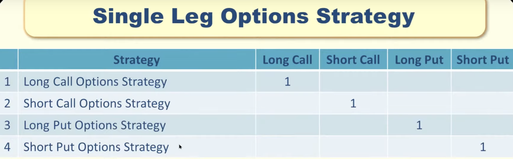
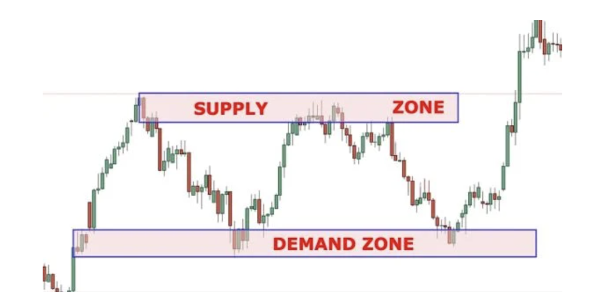
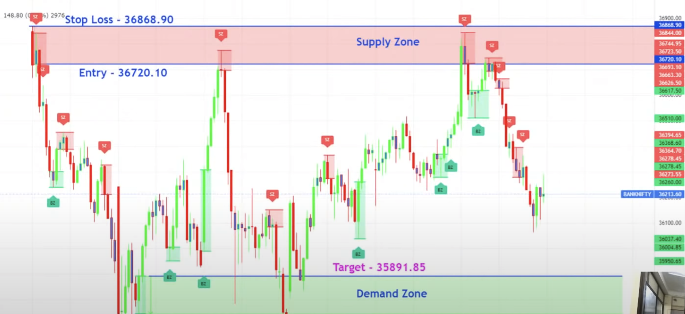
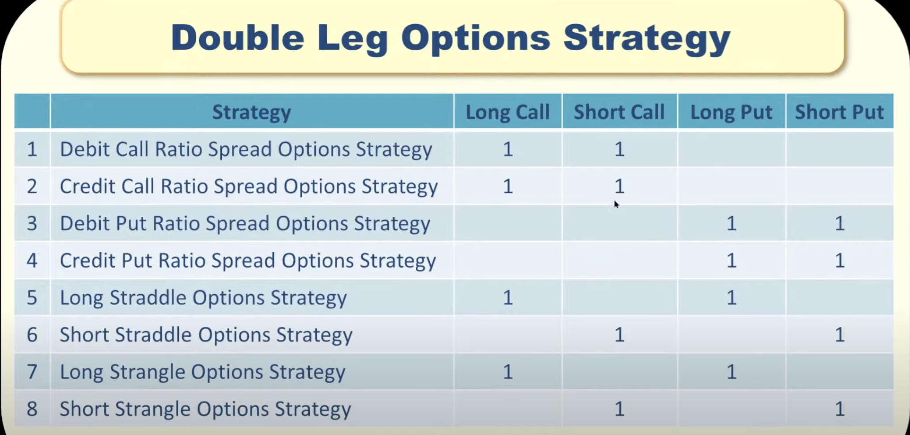
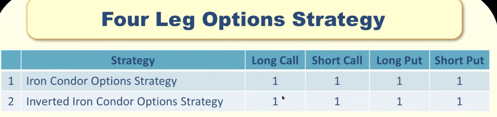
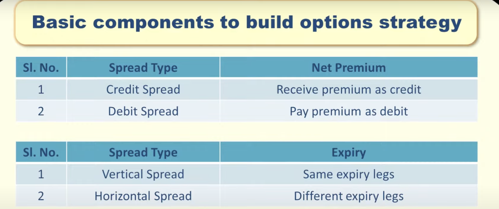

SINGLE LEG OPTIONS STRATEGY:
============================

These strategies also called as naked strategies.

Demand vs Supply Zone
----------------------

Each zone has Entry and stop loss.

When to take this strategy?

 - BUY  CALL when stock is in Demand zone 
 - SELL CALL when stock is in Supply zone

 - BUY PUT when stock is in Supply zone
 - SELL PUT when stock is in Demand zone.
 
 Entry vs StopLoss vs Target:
 ----------------------------
  
  If we take trade in supply zone, then below is entry, stoploss and target
  
  
  
  - If we take trade in supply zone, then target will be demand zone.
  - If we take trade in demand zone, then target will be supply zone.
  
  
 
 How to select Strike Price:
 ---------------------------
 
 First decide how much you can loose in this trade i.e. Caculative loss
 
 Delta = (Calculative loss / stop loss value)
 
 stop loss value = (entry - stop loss) * lot size
 
 eg: 
 Delta = (500 /1250) = 0.4  
 Now select the strike price near to 0.4 delta.
 
 
 How to select DTE(Date to Expiry):
 ----------------------------------
 
 Case 1:
   - DTE - 3 days
   - If expiry is near, then we have to choose only ITM option 
   to reduce the impact of Theta.
   
 Case 2:
   - DTE - 30 days
   - Here gamma impact will be less. 
   - Theta impact also less.
   - So, we have time to react.
 

How to select IV:
------------------

- If IV percentile is high, 
    - we have to SELL the option to get profit.
    - we have to use CREDIT strategy to get profit.
    
- If IV percentile is low, 
    - we have to BUY the option to get profit.
    - we have to use DEBIT strategy to get profit.

CREDIT STRATEGY:
---------------
 - Premium will credit to the account
 - SHORT CALL, SHORT PUT are CREDIT strategy.
 - Use CREDIT strategy, when IV percentile is high
 
DEBIT STRATEGY:
--------------- 
 - Premium will be debited from our account
 - LONG CALL, LONG PUT  are DEBIT strategy.
 - USE DEBIT strategy, when IV percentile is low.
 
 
DOUBLE LEG OPTIONS STRATEGY:
============================

FOUR LEG OPTIONS STRATEGY:
==========================

Spread Type:
==============

