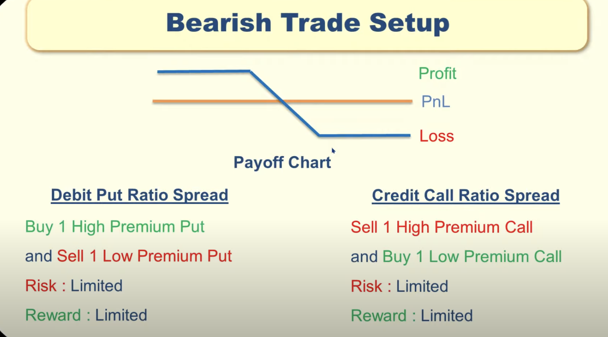
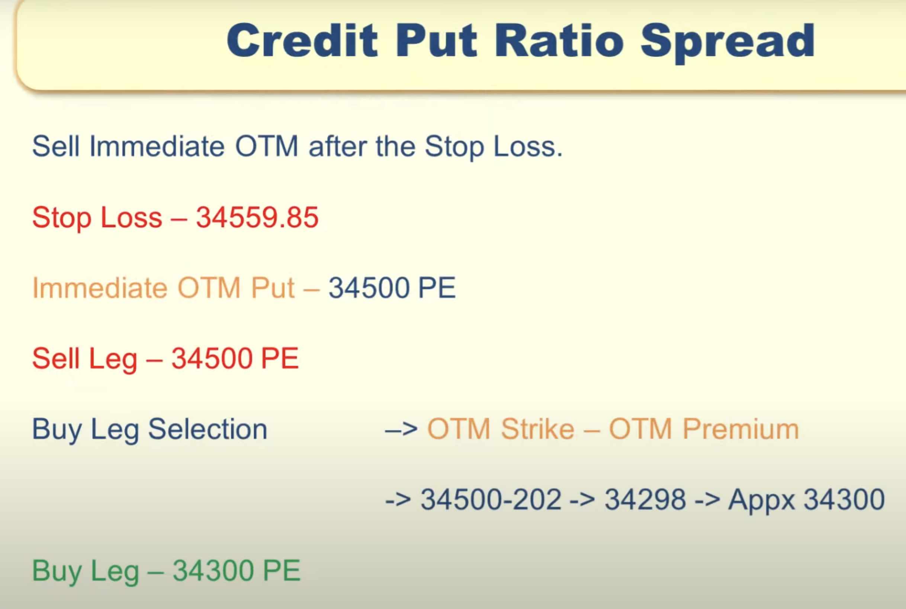
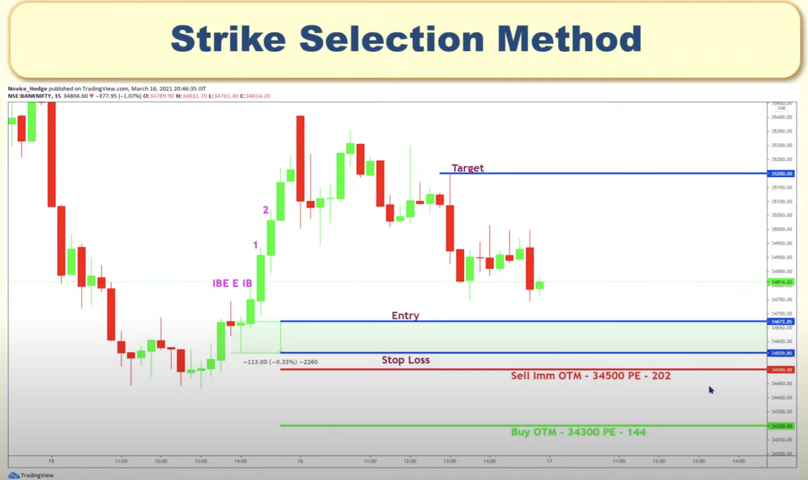

SINGLE LEG OPTIONS STRATEGY:
============================

These strategies also called as naked strategies.

Demand vs Supply Zone
----------------------

Each zone has Entry and stop loss.

When to take this strategy?

 - BUY  CALL when stock is in Demand zone 
 - SELL CALL when stock is in Supply zone

 - BUY PUT when stock is in Supply zone
 - SELL PUT when stock is in Demand zone.
 
 Entry vs StopLoss vs Target:
 ----------------------------
  
  If we take trade in supply zone, then below is entry, stoploss and target
  
  
  
  - If we take trade in supply zone, then target will be demand zone.
  - If we take trade in demand zone, then target will be supply zone.
  
  
 
 How to select Strike Price:
 ---------------------------
 
 First decide how much you can loose in this trade i.e. Caculative loss
 
 Delta = (Calculative loss / stop loss value)
 
 stop loss value = (entry - stop loss) * lot size
 
 eg: 
 Delta = (500 /1250) = 0.4  
 Now select the strike price near to 0.4 delta.
 
 
 How to select DTE(Date to Expiry):
 ----------------------------------
 
 Case 1:
   - DTE - 3 days
   - If expiry is near, then we have to choose only ITM option 
   to reduce the impact of Theta.
   
 Case 2:
   - DTE - 30 days
   - Here gamma impact will be less. 
   - Theta impact also less.
   - So, we have time to react.
 

How to select IV:
------------------

- If IV percentile is high, 
    - we have to SELL the option to get profit.
    - we have to use CREDIT strategy to get profit.
    
- If IV percentile is low, 
    - we have to BUY the option to get profit.
    - we have to use DEBIT strategy to get profit.

- If IV is going to increase, then long call or long put.

- If IV is going to decrease, then short call or short put.

CREDIT STRATEGY:
---------------
 - Premium will credit to the account
 - SHORT CALL, SHORT PUT are CREDIT strategy.
 - Use CREDIT strategy, when IV percentile is high
 
DEBIT STRATEGY:
--------------- 
 - Premium will be debited from our account
 - LONG CALL, LONG PUT  are DEBIT strategy.
 - USE DEBIT strategy, when IV percentile is low.
 
 
DOUBLE LEG OPTIONS STRATEGY:
============================

SHORT STRADDLE (NON-DIRECTIONAL):
---------------------------------
 - SELL ATM CALL & SELL ATM PUT
 - Loss: Unlimited , Profit: Limited
 - Choose when market does not move in any of the direction.
 - Most profitable strategy 
 - Margin is also high
 - Condition: Outside value CPR (Sideways Days)
 - Outside value CPR occurrence in market is very rare. Hardly monthly twice.
 - Also better to avoid when previous day has narrow CPR. Becaz that effect might still be there.
 - Don't do this strategy on expiry day.

SHORT STRANGLE (NON-DIRECTIONAL):
---------------------------------
 - SELL OTM CALL & SELL OTM PUT
 - Loss: Unlimited, Profit: Limited
 - Choose when market does not move in any of the direction.
 - Margin is not that high when compared to short straddle
 - In short strangles are cheaper but require large price movement 
   to be profitable compared to straddles.

LONG STRADDLE (BI-DIRECTIONAL):
-------------------------------
  - BUY ATM CALL & BUY ATM PUT
  - Risk: Limited , Profit: Unlimited
  - Condition: Inside Value CPR (Trending Day)
  - We can take profit only if large movement in market. 
  - Better to avoid this strategy.

LONG STRANGLE (BI-DIRECTIONAL):
-------------------------------
 - BUY LONG CALL AND LONG PUT

Spread Type:
==============

- In any ratio spread, better to select OTM.
- Use CREDIT SPREAD,
     - WHEN IV IS HIGH
     - VERY NEAR TO EXPIRY
     - When market is in sideways
- Use DEBIT SPREAD,
     - LONG EXPIRY

DEBIT CALL SPREAD (BULLISH):
---------------------------
 - BUY 1 HIGH PREMIUM CALL OPTION AND SELL 1 LOW PREMIUM CALL OPTION
 - Loss: Limited, Profit: Limited
 - Choose when market is going to be BULLISH
 - Here we are trying to limit our loss if market didn't go BULLISH
   by selling low premium call option.

CREDIT CALL SPREAD (BEARISH):
-----------------------------
- SELL 1 HIGH PREMIUM CALL OPTION AND BUY 1 LOW PREMIUM CALL OPTION
- Loss: Limited, Profit: Limited
- Choose when market is going to be BEARISH
- Here we are trying to limit our loss if market didn't go BEARISH
  by selling high premium call option.

DEBIT PUT SPREAD (BULLISH):
---------------------------
- BUY 1 HIGH PREMIUM PUT OPTION AND SELL 1 LOW PREMIUM PUT OPTION
- Loss: Limited, Profit: Limited
- Choose when market is going to be BULLISH
- Here we are trying to limit our loss if market didn't go BULLISH
  by selling low premium PUT option.
- 

CREDIT PUT SPREAD (BEARISH):
-----------------------------
- SELL 1 HIGH PREMIUM PUT OPTION AND BUY 1 PUT PREMIUM PUT OPTION
- Loss: Limited, Profit: Limited
- Choose when market is going to be BEARISH
- Here we are trying to limit our loss if market didn't go BEARISH
  by selling high premium PUT option.
  
  
     - SELL immediate OTM & Buy (OTM SELL STRIKE - PREMIUM) OTM Strike.
     - If the GAP between SELL LEG AND BUY LEG IS HIGH, LOSS% IS ALSO HIGH
- Above strategy works for Positional Trading(long term)
- Below strategy works for intraday . It works only on the expiry day.
- Make this transaction after 2:30 PM
- 3 minutes timeframe is suggested
  

FOUR LEG OPTIONS STRATEGY:
==========================

IRON CONDOR (BI-DIRECTIONAL):
------------------------------
  - Combination of CREDIT PUT SPREAD & CREDIT CALL SPREAD.
  - Profit will come only if market stays within certain range.
  - Always better do it on the day of expiry.

INVERTED IRON CONDOR (NON-DIRECTIONAL):
---------------------------------------
  - Combination of DEBIT PUT SPREAD & DEBIT CALL SPREAD.
  - Profit will come only if there is significant price movement.
  - If Inside value CPR or narrow CPR occurs, then this strategy might work.
  - Always better do it on the day of expiry.
  - Do not do it on the quarterly result day, because its debit spread. It will
    have more IV value. After result IV value will drop suddenly.
    So, we will not get profit.

