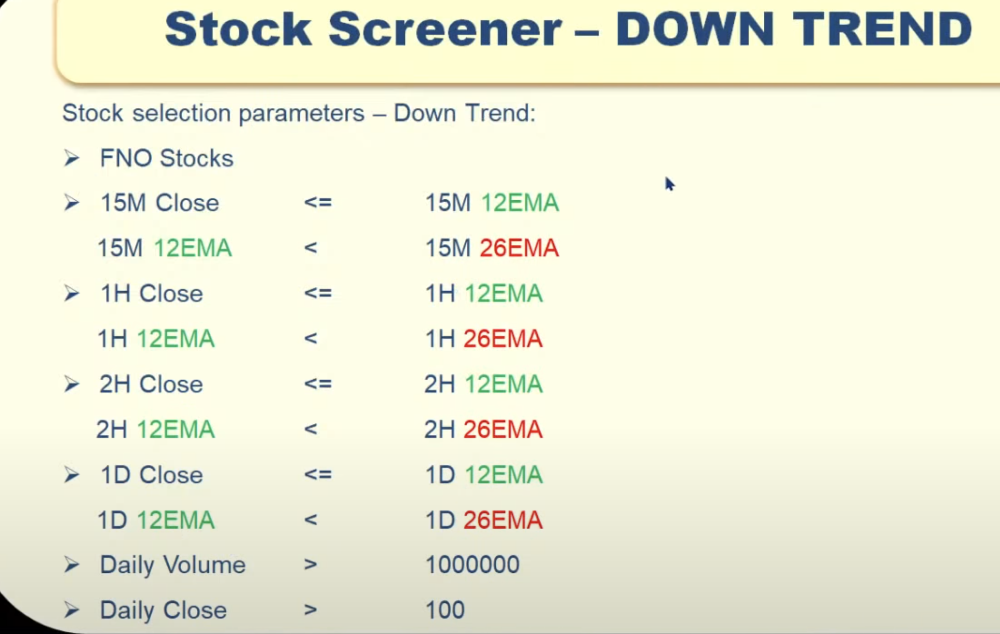
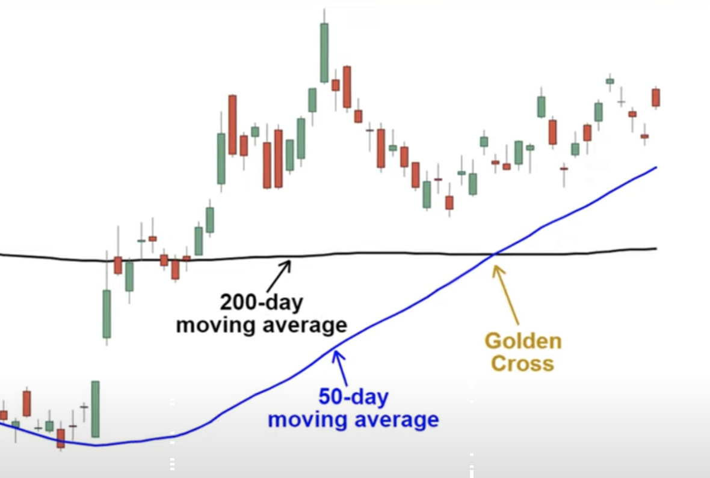
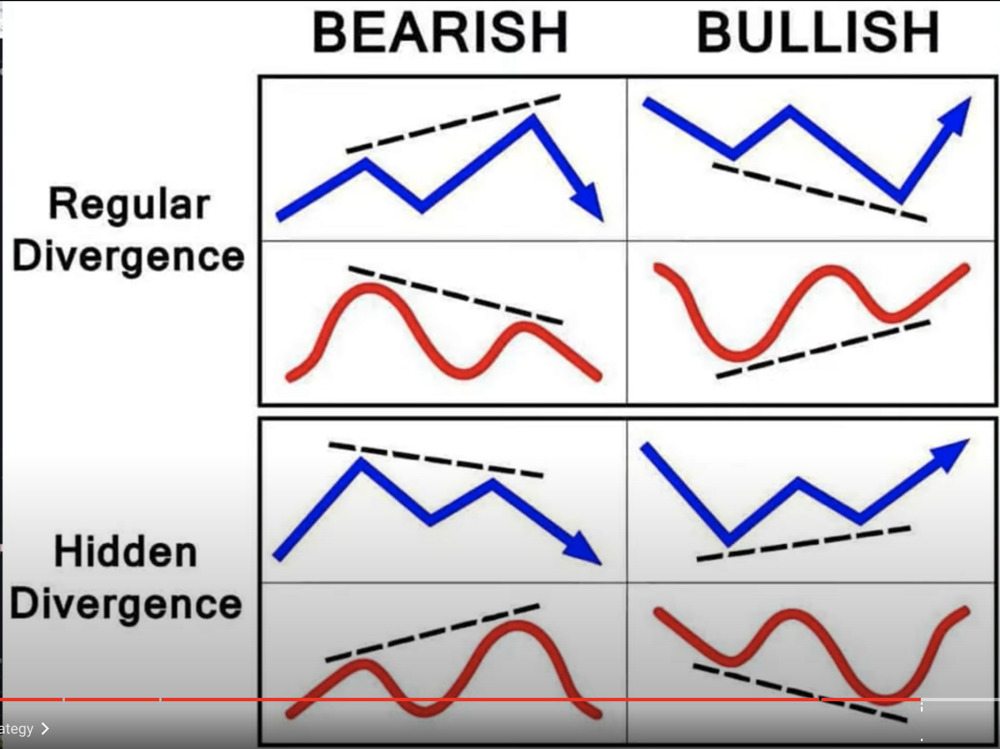
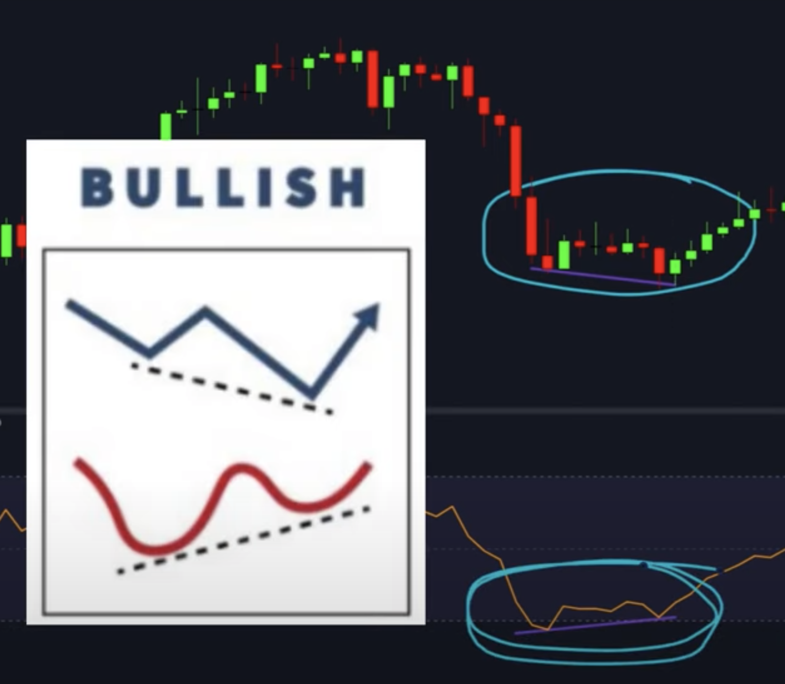
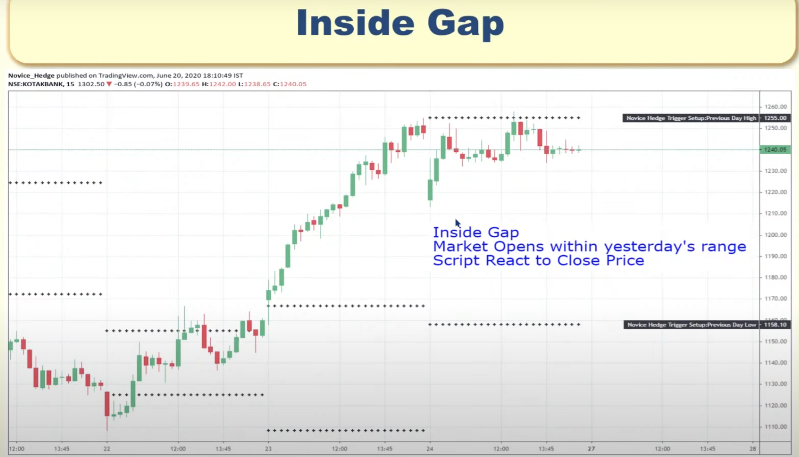
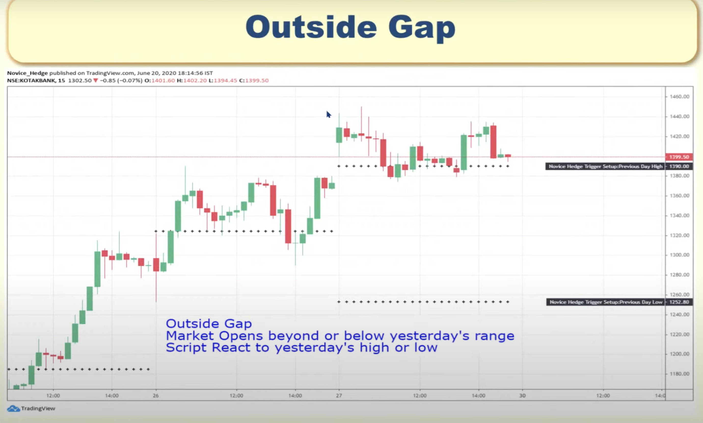
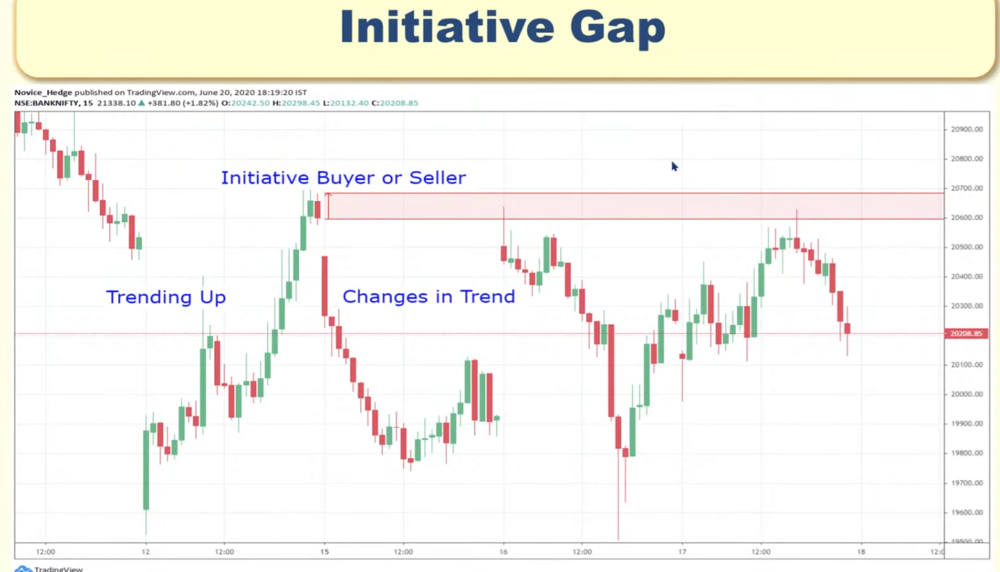
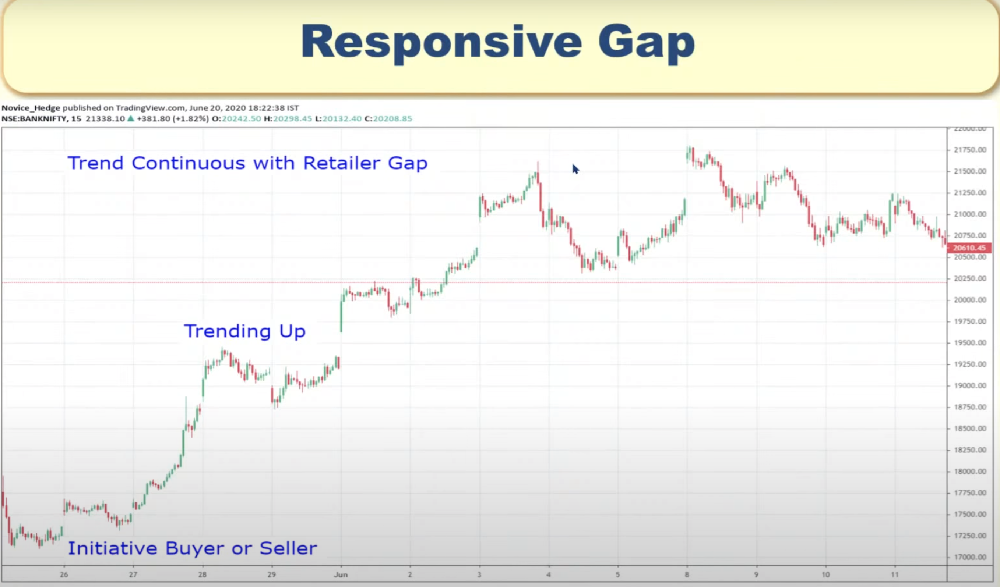
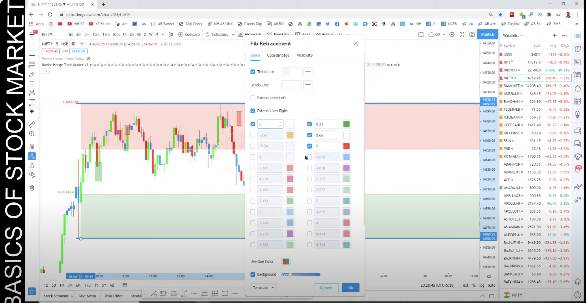
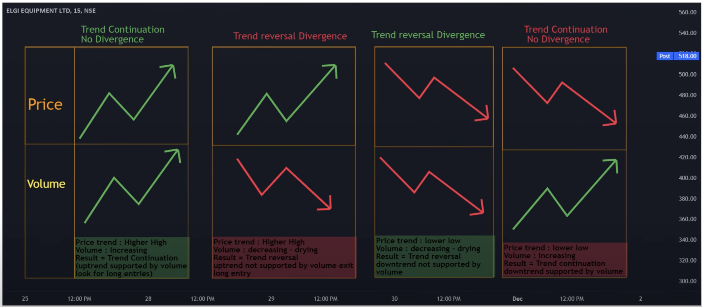

MARKET PLAYERS:
================

- Initiative Buyers
    - (banks, insurance , mutual funds, hedge funds etc.)
    - Buys stock at cheap price.
    - Buy in buy price range(eg: 100 - 110). They cannot buy at certain price point.
    - For re-entry they will wait until the price come back to same price range they entered earlier.
- Initiative Sellers 
    - (banks, insurance , mutual funds, hedge funds etc.)
    - Sells stock at high price.
- Responsive Buyers
    - Retailer - WE
    - Buys stock at high price.
- Responsive Sellers
    - Retailer - WE
    - Sells stock at cheap price.

Here we have to understand the strategy how to buy/sell at the price of 
initiative buyers/sellers.

PRICE ACTION STRATEGY:
======================

TYPES OF CANDLE:
----------------

HIGH - Highest Trade Price in that time window.
LOW  - Lowest Trade Price in that time window.
OPEN - Starting trade price in that time window.
CLOSE- Closing trade price in that time window.

E-CANDLE:
----------
- Body Range <= 50% of the Candle Range
- Transaction are happending in range that buyer and seller are in balance.
- We cannot take any decision based on E-candle because buyers and sellers are equal.

IB-CANDLE:
---------

- Body Range > 50% of Candle Range.
- this imply imbalance between buyer and seller which cause price to move up or down.
- Here either buyer will be high than sellers and vice versa.

  

ZONE FORMATION:
================
  -  Supply/demand zone can be formed only if satisfies 
 both of the below condition.

CONDITION 1:
------------

- ONE IB-CANDLE - ONE E-CANDLE - ONE IB-CANDLE
- ONE IB-CANDLE - ONE/TWO/THREE E-CANDLE - ONE IB-CANDLE
    

**Reversal Buy Zone Formation:**
   

**Continuation Buy Zone Formation**
   

**Reversal Sell Zone Formation:**
   

**Continuation Sell Zone Formation:**
   

CONDITION 2:
--------------
Buy Zone:
 

Sell Zone:
 

Example with both condition:

Buy Zone

Sell Zone
 

WHEN TO BUY WHEN ZONE FORMATION HAPPENS?

- Once its satisfies both condition, wait for it come back to previous range.
- Eg:
  

  

POWER ZONE FORMATION:
 - Special Zone
  
  

ZONE COMPONENTS:
=================
  

Line Placement:
---------------
Method 1(Body-to-Wick):

- Keep the entry line near to which E-candle has higher **BODY**.
- Keep the Stop-Loss line near to lower wick for the E-Candle.
- Best for India charts

Method 2 (Wick-to-Wick):
- Keep the entry line near to which E-candle has higher **WICK**.
- Keep the Stop-Loss line near to lower wick for the E-Candle.
- Best for International charts
  

TIME FRAME:
===========

Stock Screeners:
===============

UPTREND:
--------

DOWNTREND:
--------

MA(Moving Average):
--------------------
- Its just average price of last x days.
  
- When low period MA cross, high period MA from bottom, then likely its going to be bullish.

MACD (Moving Average Convergence Divergence):
=============================================
  - Tradingview indicator: Moving Average Convergence Divergence
  - Setup Daily timeframe in trading view.
  - Change Source to "ohlc4" instead of close which is default.
  - MACD line(blue) shows difference between 12 day EMA and 26 day EMA
  - Signal line (orange) represent 9 day EMA 
  - Below histogram shows the difference between MACD line and Signal line.
  - When histogram bar is high, then there is large price difference.
  - When Blue line(MACD) cross orange line(Signal) from above, then its bearish.
  - When Blue line cross orange line from below, then its BULLISH.
  - We dont need to rely on the line. We can get insight from the histogram.
  - If histogram mountain is green and high, then there is large diff between
    MACD line and Signal Line.
  - If Green Bar is new high, then there is strong momentum. 
  - Traders will wait for to go down, and buy.
  - If next Green bar is low than previous, then traders think about selling.
  - If price bar has higher low and MACD histogram has lower high, 
    this is called as "Divergence". It tells price is going to go down.
    
  - Check for candlestick pattern as well before making trading.
  - To find the MACD Divergence line, there is indicator available "MACD Divergences by @DavidTech"
    which of the following option does not take the collections aggregatekey and throws an error?   a ) val sets = pairs.reduceByKey(new HashSet[Int)(_ + ) b) val sets = pairs.aggregateByKey
RSI(Relative Strength Index):
-----------------------------
- RSI value range from 0 to 100.
- If RSI value is less than 30, then its considered as oversold.
- If RSI value is greater than 70, then its considered as overbought.
- If RSI > 70, its not always true that price will go down. 
- Tradingview indicator: Relative Strength Index 
- Tradingview indicator: Divergence Indicator
- Uncheck RSI-based MA . its not required for trading.
- How to take trade based on RSI:
  
- In above image, RSI prints one low and another higher low and price prints one high low and one lower low.
- In works in Double bottom pattern as well. RSI should print one low 
  and another higher low.
- RSI Length adjust to 28 days for better trading.

Bollinger Bands & Fibonacci :
=============================
- TradingView Indicator: Bollinger Bands Fibonacci ratios
- Bollinger Bands consists for Orange Line and Blue line.
- Orange Line in middle is Simple Moving Average (MA)
- When price movement is high, then blue upper and lower line will move away from Orange Line.
- Upper blue line (upper band) is 2 standard deviation above from Middle band (orange line)
- Lower Blue line (lower band) is 2 standard deviation below from middle band (orange line)
- How to trade with this indicator?
   - First look for any candle which is outside of upper band or lower band(Free bar).
   - 99% of candle stick will be inside the band.
   - But if we find candle outside of upper band, its overbought, bears will take control.
   - Also make sure that candle follows bearish candlestick pattern.

Breakout Probability:
---------------------
- Tradingview indicator: Breakout Probability

HTF zone Confluence:
--------------------

Types of Gaps:
==============
 
 - Inside Gap  ( Reacts to Close)
    - If Market open within yesterday's High and Low, then market react to yesterdays close value
     
 - Outside Gap ( Reacts to High or Low)
    - Market open beyond or below yesterdays range. Script react to yesterdays high or low.
      
 - Initiative Gap ( Reversal Pattern)
      
 - Responsive Gap ( Continuous Pattern)
      

Fibanocci Marking:
==================

   - Mark the yesterday's high and low. 
   - On the next day, do trading only in RED OR GREEN ZONE. IGNORE THE WHITE ZONE.

Price Vs Volume Trading:
========================

