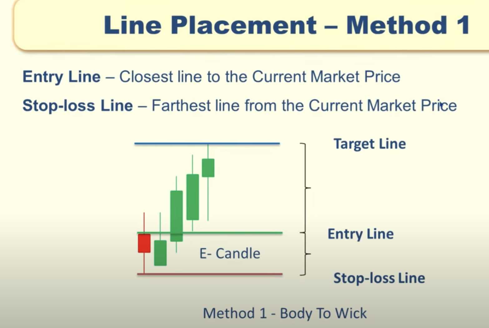

MARKET PLAYERS:
================

- Initiative Buyers
    - (banks, insurance , mutual funds, hedge funds etc.)
    - Buys stock at cheap price.
    - Buy in buy price range(eg: 100 - 110). They cannot buy at certain price point.
    - For re-entry they will wait until the price come back to same price range they entered earlier.
- Initiative Sellers 
    - (banks, insurance , mutual funds, hedge funds etc.)
    - Sells stock at high price.
- Responsive Buyers
    - Retailer - WE
    - Buys stock at high price.
- Responsive Sellers
    - Retailer - WE
    - Sells stock at cheap price.

Here we have to understand the strategy how to buy/sell at the price of 
initiative buyers/sellers.

PRICE ACTION STRATEGY:
======================

TYPES OF CANDLE:
----------------

HIGH - Highest Trade Price in that time window.
LOW  - Lowest Trade Price in that time window.
OPEN - Starting trade price in that time window.
CLOSE- Closing trade price in that time window.

E-CANDLE:
----------
- Body Range <= 50% of the Candle Range
- Transaction are happending in range that buyer and seller are in balance.
- We cannot take any decision based on E-candle because buyers and sellers are equal.

IB-CANDLE:
---------

- Body Range > 50% of Candle Range.
- this imply imbalance between buyer and seller which cause price to move up or down.
- Here either buyer will be high than sellers and vice versa.

  

ZONE FORMATION:
================
  -  Supply/demand zone can be formed only if satisfies 
 both of the below condition.

CONDITION 1:
------------

- ONE IB-CANDLE - ONE E-CANDLE - ONE IB-CANDLE
- ONE IB-CANDLE - ONE/TWO/THREE E-CANDLE - ONE IB-CANDLE
    

**Reversal Buy Zone Formation:**
   

**Continuation Buy Zone Formation**
   

**Reversal Sell Zone Formation:**
   

**Continuation Sell Zone Formation:**
   

CONDITION 2:
--------------
Buy Zone:
 

Sell Zone:
 

Example with both condition:

Buy Zone

Sell Zone
 

WHEN TO BUY WHEN ZONE FORMATION HAPPENS?

- Once its satisfies both condition, wait for it come back to previous range.
- Eg:
  

  

POWER ZONE FORMATION:
 - Special Zone
  
  

ZONE COMPONENTS:
=================
  

Line Placement:
---------------
Method 1(Body-to-Wick):

- Keep the entry line near to which E-candle has higher **BODY**.
- Keep the Stop-Loss line near to lower wick for the E-Candle.
- Best for India charts

Method 2 (Wick-to-Wick):
- Keep the entry line near to which E-candle has higher **WICK**.
- Keep the Stop-Loss line near to lower wick for the E-Candle.
- Best for International charts
  

TIME FRAME:
===========

Stock Screener:
===============

UPTREND:
--------

